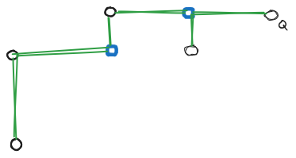

# Summary of Shortest Path Algorithm for Grid Graphs
 - by F.O. Haddock 1977

Two special properties of grid graphs: uniform edge lengths and direction. Called the minimum detour algorithm,

Notation: 
- $d_M(P,Q)$ is the Manhattan distance between $P$ and $Q$ vertices    
- $u$ is the intermediate vertex between source $P$ and target $Q$. Let $v$ be a neighbor to $u$, Two possible sets for $v$ are :
  - $Q$-positive if $d_M(v,Q) + 1 = d_M(u,Q)$  ($v$ is one unit closer than $u$)
  - $Q$-negative if $d_M(v,Q) - 1 = d_M(u,Q)$  ($v$ is one unit farther than $u$)

Path length, $L$ from $P$ to $Q = d_M(P,Q) + 2d$ , st. $d$ is detour number of $L$ wrt. $Q$ ( times $u$ moves away from $Q$)
- Thus the goal is to minimize detours


```
let v be neighbors of u. 
let N-Stack hold unmarked Q-neg v and P-stack hold unmarked Q-pos v
0)  u := P; d := 0;
1)  mark u
    if (u = Q), break;
    N-Stack.push( unmarked Q-negative neighbors of u );
    if no unmarked Q-pos exist

```


