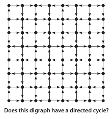

# 2D Grid Breadth First Search Visualization

Uses `BreadthFirstPaths` to find the path from a given source to a target.
Animates an expanding wavefront from the source until the target is found.

## Digraph cycle finder 

start a timer, prompt user to find a digraph cycle within the time.
Evaluate the edges surrounding the square chosen by mouse input by the user.
highlight all the directed cycles, and score the user.

  
